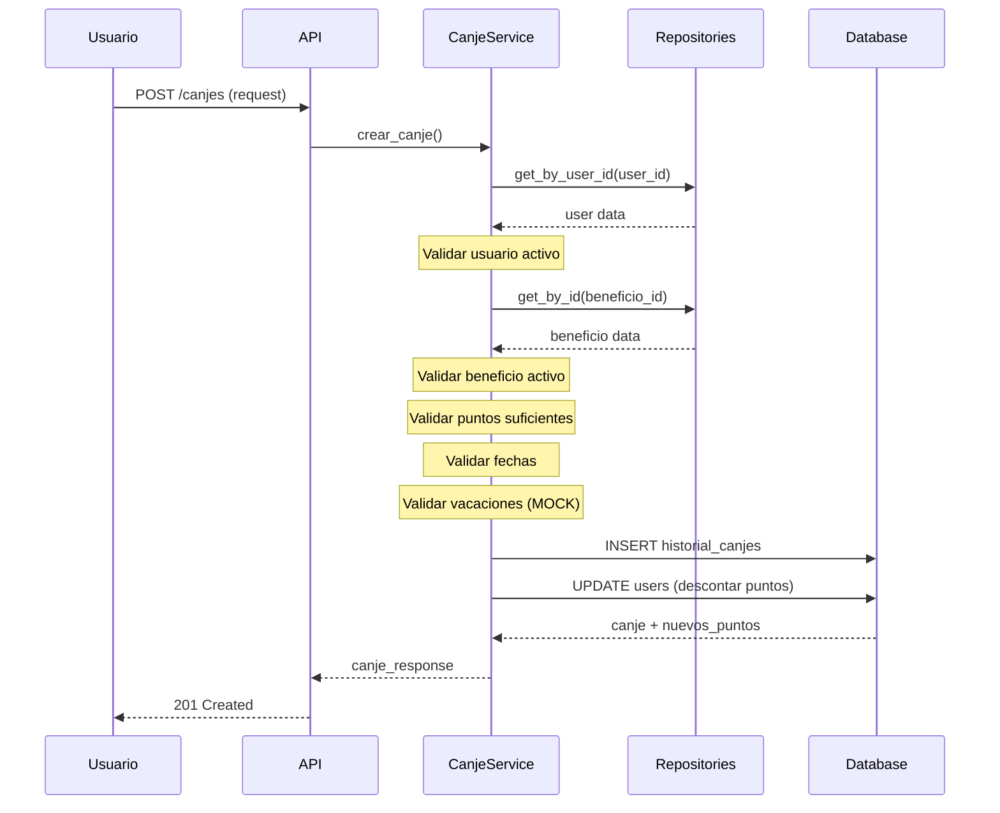

# Sistema de Canje de Puntos

## Descripción General

Sistema completo para el canje de puntos por beneficios con validaciones de negocio, registro histórico y descuento automático de puntos.

## Arquitectura

```
app/
├── api/
│   ├── routers/
│   │   └── canje_router.py       # Endpoints REST
│   └── schemas/
│       └── canje_schema.py       # Esquemas Pydantic
├── services/
│   └── canje_service.py          # Lógica de negocio
└── repositories/
    └── canje_repository.py       # Acceso a datos (SQL RAW)

migrations/
└── 003_create_historial_canjes_table.sql
```

## Tabla: historial_canjes

```sql
CREATE TABLE puntos_flesan.historial_canjes (
    id UUID PRIMARY KEY,
    user_id INTEGER NOT NULL,
    beneficio_id INTEGER NOT NULL,
    puntos_canjeados INTEGER NOT NULL,
    fecha_canje TIMESTAMP WITH TIME ZONE NOT NULL,
    fecha_uso TIMESTAMP WITH TIME ZONE NOT NULL,
    estado VARCHAR(50) DEFAULT 'ACTIVO',
    observaciones TEXT NULL,
    created_at TIMESTAMP WITH TIME ZONE NOT NULL,
    updated_at TIMESTAMP WITH TIME ZONE NULL
);
```

## Estados de Canje

| Estado | Descripción |
|--------|-------------|
| `ACTIVO` | Canje vigente sin usar |
| `USADO` | Beneficio ya utilizado |
| `CANCELADO` | Canje cancelado (devuelve puntos) |
| `VENCIDO` | Canje vencido sin uso |

## Validaciones de Negocio

### Al Crear un Canje

1. **Usuario existe y está activo**
   - El user_id debe corresponder a un usuario registrado
   - El usuario debe tener estado `is_active = true`

2. **Beneficio existe y está activo**
   - El beneficio_id debe corresponder a un beneficio registrado
   - El beneficio debe tener estado `is_active = true`

3. **Puntos suficientes**
   - `puntos_disponibles >= puntos_utilizar`
   - Validación en tiempo real antes del canje

4. **Puntos dentro del límite**
   - `puntos_utilizar <= valor_beneficio`
   - No se puede usar más de lo que vale el beneficio

5. **Fecha de uso válida**
   - `fecha_uso > fecha_canje`
   - La fecha de uso debe ser posterior al canje

6. **Vacaciones acumuladas**
   - El usuario no debe tener más de 30 días de vacaciones acumulados
   - **NOTA:** Actualmente usa valor MOCK (15 días)
   - TODO: Integrar con datawarehouse para obtener valor real

## Endpoints

### POST /api/v1/canjes/
**Crear nuevo canje**

```json
{
  "user_id": 6070,
  "beneficio_id": 1,
  "puntos_utilizar": 100,
  "fecha_canje": "2025-01-24T10:00:00",
  "fecha_uso": "2025-02-01T10:00:00",
  "observaciones": "Canje para día libre"
}
```

**Respuesta:**
```json
{
  "id": "uuid",
  "user_id": 6070,
  "beneficio_id": 1,
  "puntos_canjeados": 100,
  "fecha_canje": "2025-01-24T10:00:00",
  "fecha_uso": "2025-02-01T10:00:00",
  "estado": "ACTIVO",
  "observaciones": "Canje para día libre",
  "puntos_restantes": 900,
  "created_at": "2025-01-24T10:00:00",
  "updated_at": null
}
```

**Efectos:**
- Se registra el canje en `historial_canjes`
- Se descuentan automáticamente los puntos del usuario
- Se retorna el nuevo saldo de puntos

### GET /api/v1/canjes/{canje_id}
**Obtener canje por ID**

Retorna la información detallada de un canje específico.

### GET /api/v1/canjes/usuario/{user_id}
**Listar canjes de un usuario**

Query params:
- `page` (int): Número de página (default: 1)
- `size` (int): Tamaño de página (default: 10, max: 100)
- `estado` (string): Filtrar por estado (opcional)

### GET /api/v1/canjes/
**Listar todos los canjes**

Query params:
- `page` (int): Número de página
- `size` (int): Tamaño de página
- `user_id` (int): Filtrar por usuario (opcional)
- `beneficio_id` (int): Filtrar por beneficio (opcional)
- `estado` (string): Filtrar por estado (opcional)

### PATCH /api/v1/canjes/{canje_id}/estado
**Actualizar estado de canje**

```json
{
  "estado": "USADO",
  "observaciones": "Beneficio utilizado correctamente"
}
```

**Comportamiento especial:**
- Si se cancela un canje `ACTIVO` → Los puntos se devuelven automáticamente al usuario

## Flujo Completo de Canje



## Casos de Uso

### Caso 1: Canje Exitoso
```
Usuario: 6070 (1000 puntos)
Beneficio: Día libre (100 puntos)
Puntos a usar: 100

Resultado:
✓ Canje registrado
✓ Usuario queda con 900 puntos
✓ Estado: ACTIVO
```

### Caso 2: Puntos Insuficientes
```
Usuario: 6070 (50 puntos)
Beneficio: Día libre (100 puntos)
Puntos a usar: 100

Resultado:
✗ Error 400: "Puntos insuficientes"
```

### Caso 3: Cancelación de Canje
```
PATCH /canjes/{id}/estado
{
  "estado": "CANCELADO"
}

Resultado:
✓ Estado actualizado a CANCELADO
✓ Puntos devueltos al usuario
✓ Usuario recupera los 100 puntos
```

## Seguridad

- Todos los endpoints requieren autenticación (`get_current_user`)
- Transacciones atómicas: Si algo falla, todo se revierte
- Validación de datos con Pydantic
- SQL Injection safe (SQL RAW con parámetros nombrados)

## Pendientes / TODOs

1. **Integración con Datawarehouse**
   - Implementar consulta real para días de vacaciones acumulados
   - Actualmente usa valor MOCK (15 días)
   - Ver: `CanjeService._obtener_dias_vacaciones_acumulados()`

2. **Mejoras Futuras**
   - Notificaciones por email al realizar canje
   - Recordatorios de uso de beneficios próximos a vencer
   - Dashboard de estadísticas de canjes
   - Reportes de beneficios más canjeados

## Testing

### Migración Base de Datos
```bash
# Ejecutar migración
psql -h localhost -U postgres -d puntos_flesan -f migrations/003_create_historial_canjes_table.sql
```

### Prueba Manual con curl

1. **Crear canje:**
```bash
curl -X POST "http://localhost:8000/api/v1/canjes/" \
  -H "Content-Type: application/json" \
  -H "Authorization: Bearer TOKEN" \
  -d '{
    "user_id": 6070,
    "beneficio_id": 1,
    "puntos_utilizar": 100,
    "fecha_canje": "2025-01-24T10:00:00",
    "fecha_uso": "2025-02-01T10:00:00"
  }'
```

2. **Listar canjes de usuario:**
```bash
curl -X GET "http://localhost:8000/api/v1/canjes/usuario/6070?page=1&size=10" \
  -H "Authorization: Bearer TOKEN"
```

3. **Actualizar estado:**
```bash
curl -X PATCH "http://localhost:8000/api/v1/canjes/{id}/estado" \
  -H "Content-Type: application/json" \
  -H "Authorization: Bearer TOKEN" \
  -d '{
    "estado": "USADO",
    "observaciones": "Utilizado correctamente"
  }'
```

## Consideraciones de Performance

- Índices creados en:
  - `user_id` - Para consultas por usuario
  - `beneficio_id` - Para consultas por beneficio
  - `fecha_canje` - Para ordenamiento temporal
  - `fecha_uso` - Para búsqueda de beneficios próximos
  - `estado` - Para filtrado por estado

- Paginación obligatoria en listados
- Límite máximo de 100 registros por página

## Mantenimiento

### Consultas Útiles

**Ver canjes activos de un usuario:**
```sql
SELECT * FROM puntos_flesan.historial_canjes
WHERE user_id = 6070 AND estado = 'ACTIVO'
ORDER BY fecha_uso ASC;
```

**Total de puntos canjeados por usuario:**
```sql
SELECT user_id, SUM(puntos_canjeados) as total_canjeado
FROM puntos_flesan.historial_canjes
WHERE estado != 'CANCELADO'
GROUP BY user_id;
```

**Beneficios más canjeados:**
```sql
SELECT beneficio_id, COUNT(*) as total_canjes
FROM puntos_flesan.historial_canjes
WHERE estado != 'CANCELADO'
GROUP BY beneficio_id
ORDER BY total_canjes DESC;
```
